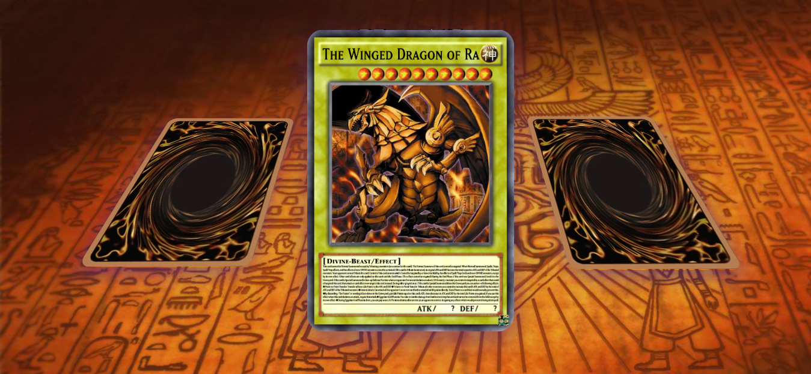
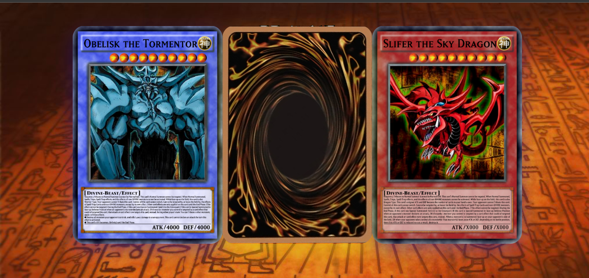

# Cards-Yugioh

## Aplicação

A visualização da aplicação pelo navegador <a target="_blank" href="https://leandroncosta.github.io/cards-Yugioh/">Clique aqui</a> (vai abrir em outra aba)

## O que é?
- A aplicação é um baralho com as famosas cartinhas do YugiOh, as cartas tem algumas interações como Zomm hover, girar as cartas e esconder. 
- Foram feitos com HTML5 e CSS3 para colocar um pouco em prática o CSS3 3d, perspective e rotacionar itens.

## Demonstração

